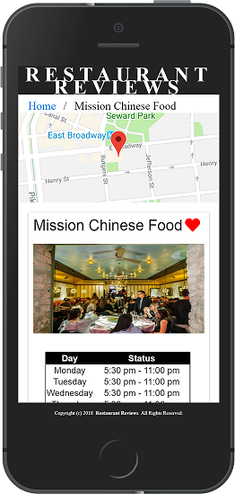
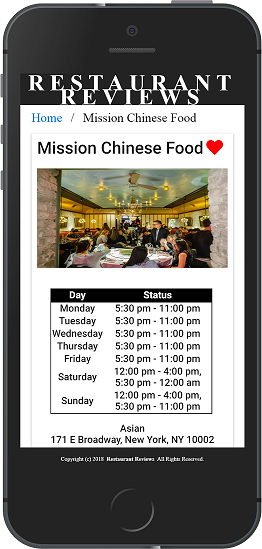

# README

<a href="https://www.udacity.com/">
  
</a>

[Udacity Google Mobile Web Specialist Nanodegree program](https://www.udacity.com/course/mobile-web-specialist-nanodegree--nd024)

[Project . Restaurant Reviews app](https://github.com/ardnahcivar/mws-restaurant-reviews)

Ravichandra Bhanage

[ardnahcivar](https://github.com/ardnahcivar)

[](https://choosealicense.com/)

[](https://github.com/standard/standard)

## Table of Contents <!-- omit in toc -->

- [Description](#description)
- [Project](#project)
  - [Stage 1](#Stage-1)
  - [Stage 2](#Stage-2)
  - [Stage 3](#Stage-3)

## Description

Mobile Web Specialists are trained in building **Progressive Web Apps** (PWAs, see [Google](https://developers.google.com/web/progressive-web-apps/) and [Mozilla](https://developer.mozilla.org/en-US/docs/Web/Apps/Progressive)). PWAs are like a combination of web apps and native apps, improving on the best features of each. I learned how to build PWAs in the [Udacity Google Mobile Web Specialist Nanodegree program](https://www.udacity.com/course/mobile-web-specialist-nanodegree--nd024).
I was awarded a scholarship to this Nanodegree program after completing the [Google India Challenge Scholarship](https://in.udacity.com/google-india-scholarships) Udacity challenge course, intermediate web developer track, in the top 10% of 10,000 students. Materials from the challenge course are available in my [udacity-google repo](https://github.com/br3ndonland/udacity-google).

See the [Udacity Mobile Web Specialist Nanodegree Certificate](https://confirm.udacity.com/HXHQJZFU)

In this Nanodegree program, I built a restaurant reviews PWA that displays restaurant locations and info. The app provides offline access through the Service Worker, IndexedDB, and web manifest files. Users can add favorites and reviews for restaurants. If changes are made offline, they sync to the web server when network access is restored.

&nbsp;&nbsp;&nbsp;&nbsp;&nbsp;&nbsp;&nbsp;&nbsp;
&nbsp;&nbsp;&nbsp;&nbsp;&nbsp;&nbsp;
&nbsp;&nbsp;&nbsp;&nbsp;&nbsp;&nbsp;

&nbsp;&nbsp;&nbsp;&nbsp;&nbsp;&nbsp;&nbsp;&nbsp;
&nbsp;&nbsp;&nbsp;&nbsp;&nbsp;&nbsp;
&nbsp;&nbsp;&nbsp;&nbsp;&nbsp;&nbsp;

## Project 

The Project  comprised of three stages:

### Stage-1
1. **Responsive design**
2. **Accessibility features**
3. **Offline capability**

Run a local HTTP server to test the application. There are multiple pages, so it is helpful to run a server instead of directly opening the HTML in a browser.

  ```sh
  cd <PATH>
  python3 -m http.server 8000
  ```

Browse to [localhost:8000](http://localhost:8000) to see the app.

### Stage-2

#### Data API in Stage 2

In project 2, we use a Node server to deliver the data API.

- Clone the [server repo](https://github.com/udacity/mws-restaurant-stage-2) into a separate directory.
- Start the data server:

  ```sh
  cd <PATH>
  npm i
  npm i sails -g
  node server
  ```

#### Web server in Stage 2

- Start the web server in the project directory.

  ```sh
  cd <PATH>/src
  python3 -m http.server 8000
  ```

- The app calls the data server on port `1337`.
- The data server actually fetches the data from the same place as before, *data/restaurants.json*, but it presents the data as an API instead of just a JSON file.
- Browse to [localhost:8000](http://localhost:8000) to see the app.

#### IndexedDB

- The app stores the JSON data in IndexedDB for offline access.

#### Performance in Stage 2

We were required to meet [Lighthouse](https://developers.google.com/web/tools/lighthouse/) performance benchmarks for progressive web apps:

- **Performance** ≥70
- **Progressive Web App** ≥90
- **Accessibility** ≥90

My app's Lighthouse scores:

- **Performance** 94
- **PWA** 92
- **Accessibility** 100

### Stage-3

#### Data API in Stage 3

We use a different Node server to deliver the data API.

- Clone the [project 3 server repo](https://github.com/udacity/mws-restaurant-stage-3) into a separate directory.
- Start the data server:

  ```sh
  cd <PATH>
  npm i
  npm i sails -g
  node server
  ```

#### Web server in Stage 3

- Start the web server in the project directory.

  ```sh
  cd <PATH>/src
  python3 -m http.server 8000
  ```

- Browse to [localhost:8000](http://localhost:8000) to see the app.

#### Favorites and reviews

- Users can now favorite restaurants and add reviews.
- Favorites and reviews are saved to IndexedDB, then synced to the data server when network access is present.

#### Performance in Stage 3

We were required to meet [Lighthouse](https://developers.google.com/web/tools/lighthouse/) performance benchmarks for progressive web apps:

- **Performance** ≥90
- **Progressive Web App** ≥90
- **Accessibility** ≥90

My app's Lighthouse scores:

- **Performance** 96
- **Progressive Web App** 94
- **Accessibility** 100